# cli-loaders for react

> Braille unicode spinners as React decorator components. — **[Live demo →](https://cli-loaders-two.vercel.app)**

<div align="center">
  
  
  
  
  
  
  
  
  
  
  
  
  
  
  
  
  
  
  
</div>

`cli-loaders` gives you 19 animated braille-glyph spinners as a set of composable, accessible React components. Zero runtime dependencies beyond React itself.

## Install

```sh
npm install cli-loaders
# or
pnpm add cli-loaders
# or
yarn add cli-loaders
```

**Requires React ≥ 18.**

## Quick start

```tsx
import { Spinner } from 'cli-loaders';

// Minimal — defaults to the "braille" spinner
<Spinner />

// Named + coloured
<Spinner name="helix" color="#7c3aed" size="1.5rem" />
```

## Components

### `<Spinner>`

The base animated glyph. Renders as an inline `<span>` so it drops naturally into any line of text.

| Prop | Type | Default | Description |
|---|---|---|---|
| `name` | `SpinnerName` | `"braille"` | Which spinner animation to use |
| `color` | `string` | `currentColor` | CSS color value |
| `size` | `string \| number` | `undefined` | Font size of the glyph, e.g. `"1.5rem"` or `24` |
| `speed` | `number` | `1` | Playback multiplier — `2` = twice as fast |
| `paused` | `boolean` | `false` | Freeze the animation |
| `ignoreReducedMotion` | `boolean` | `false` | Override `prefers-reduced-motion` and always animate |
| `label` | `string` | `"Loading"` | Accessible label announced by screen readers |
| `className` | `string` | — | Applied to the outer `<span>` |
| `style` | `CSSProperties` | — | Inline styles for the outer `<span>` |
| `ref` | `Ref<HTMLSpanElement>` | — | Forwarded to the outer `<span>` |

Any additional HTML span attributes are forwarded.

---

### `<SpinnerInline>`

Spinner + children in a flex row — handy for inline status messages.

```tsx
<SpinnerInline name="braille" color="#00ff99">
  Fetching data…
</SpinnerInline>
```

Accepts all `Spinner` props plus:

| Prop | Type | Default | Description |
|---|---|---|---|
| `gap` | `string \| number` | `"0.4em"` | Gap between spinner and children |
| `children` | `ReactNode` | — | Content rendered after the spinner |

---

### `<SpinnerText>`

Decorates a text string with spinners — supports a bookend mode that mirrors one on each end.

```tsx
<SpinnerText text="Deploying" color="#f59e0b" bookend />
// ⠿ Deploying ⠿
```

| Prop | Type | Default | Description |
|---|---|---|---|
| `text` | `string` | required | The text to decorate |
| `bookend` | `boolean` | `false` | Place a spinner on both sides |
| `gap` | `string \| number` | `"0.4em"` | Gap between spinners and text |

Plus all `Spinner` props.

---

### `<SpinnerBadge>`

A tinted pill badge with a spinner — good for live status indicators.

```tsx
<SpinnerBadge label="Live"     color="#ef4444" />
<SpinnerBadge label="Syncing"  color="#38bdf8" />
<SpinnerBadge label="Building" color="#f59e0b" />
```

| Prop | Type | Default | Description |
|---|---|---|---|
| `label` | `string` | required | Badge text (also used as the a11y label) |
| `paddingY` | `string` | `"0.4em"` | Vertical padding |
| `paddingX` | `string` | `"0.8em"` | Horizontal base padding |
| `balanceRatio` | `number` | `0.3` | Extra right padding fraction for optical balance |
| `borderRadius` | `string \| number` | `"999px"` | Border radius |
| `gap` | `string \| number` | `"0.35em"` | Gap between glyph and label |

Plus all `Spinner` props.

---

### `<SpinnerTrail>`

Renders a sliding window of recent frames with decreasing opacity — creates a ghost/motion-blur trail effect.

```tsx
<SpinnerTrail name="helix" color="#7c3aed" size="2rem" trailLength={6} />
```

| Prop | Type | Default | Description |
|---|---|---|---|
| `trailLength` | `number` | `4` | Number of ghost frames (including the current one) |
| `minOpacity` | `number` | `0.1` | Opacity of the oldest ghost frame |
| `reverse` | `boolean` | `false` | Flip the opacity gradient (bright on left, fading right) |

Plus all `Spinner` props.

---

### `<SpinnerButton>`

A `<button>` with a built-in loading state. Disables itself and shows a spinner when `loading` is true. Fully forwarded ref.

```tsx
<SpinnerButton
  loading={isSaving}
  onClick={handleSave}
  spinnerProps={{ name: 'braille', color: '#00ff99' }}
>
  Save changes
</SpinnerButton>
```

| Prop | Type | Default | Description |
|---|---|---|---|
| `loading` | `boolean` | `false` | Show spinner and disable the button |
| `spinnerPosition` | `"left" \| "right"` | `"left"` | Which side the spinner appears on |
| `spinnerGap` | `string \| number` | `"0.45em"` | Gap between spinner and button label |
| `spinnerProps` | `Omit<BaseSpinnerProps, "size">` | — | Props forwarded to the inner `<Spinner>` |

All standard `<button>` attributes are forwarded.

---

### `<SpinnerOverlay>`

Wraps any content and renders a centered spinner overlay when `active`. Uses the native `inert` attribute to block keyboard/pointer access to the content beneath.

```tsx
<SpinnerOverlay
  active={isLoading}
  name="orbit"
  color="#7c3aed"
  size="2.5rem"
  backdrop="rgba(0,0,0,0.4)"
>
  <YourContent />
</SpinnerOverlay>
```

| Prop | Type | Default | Description |
|---|---|---|---|
| `active` | `boolean` | `true` | Show the overlay |
| `backdrop` | `string` | `"rgba(0,0,0,0.35)"` | CSS background for the backdrop |
| `size` | `string \| number` | `"2rem"` | Spinner glyph size |
| `containerStyle` | `CSSProperties` | — | Style applied to the outer wrapper `<div>` |
| `containerClassName` | `string` | — | Class applied to the outer wrapper `<div>` |
| `children` | `ReactNode` | — | Content that gets overlaid |

Plus all `Spinner` props.

---

### `<SpinnerProvider>`

Sets global defaults for every `Spinner`-family component in the subtree. Individual props override context values.

```tsx
<SpinnerProvider
  defaultName="orbit"
  defaultColor="#7c3aed"
  defaultSpeed={1.2}
  respectReducedMotion={true}
>
  <App />
</SpinnerProvider>

// Inside: no props needed — picks up context defaults
<Spinner />
<SpinnerBadge label="Live" />
```

| Prop | Type | Default | Description |
|---|---|---|---|
| `defaultName` | `SpinnerName` | `"braille"` | Default spinner name |
| `defaultColor` | `string` | `undefined` | Default color |
| `defaultSize` | `string \| number` | `undefined` | Default glyph size |
| `defaultSpeed` | `number` | `1` | Default speed multiplier |
| `respectReducedMotion` | `boolean` | `true` | Pause animations when the OS has `prefers-reduced-motion: reduce` |

---

## `useSpinner` hook

Drive any element with the raw frame string for fully custom rendering.

```tsx
import { useSpinner } from 'cli-loaders';

function MyComponent() {
  const frame = useSpinner('helix', 1.5);

  return (
    <h1 style={{ fontFamily: 'monospace', color: '#00ff99' }}>
      {frame}
    </h1>
  );
}
```

```ts
useSpinner(
  name: SpinnerName,
  speed?: number,           // default 1
  paused?: boolean,         // default false
  ignoreReducedMotion?: boolean  // default false
): string
```

### `useSpinnerFrames`

Returns a sliding window of the last `length` frames — the primitive behind `SpinnerTrail`.

```ts
useSpinnerFrames(
  name: SpinnerName,
  length?: number,          // default 3
  speed?: number,
  paused?: boolean,
  ignoreReducedMotion?: boolean
): string[]
```

---

## Available spinners

All 19 names are available as the `SpinnerName` union type.

```ts
import { spinnerNames } from 'cli-loaders';
// ['braille', 'braillewave', 'dna', ...]
```

---

## Accessibility

- The animated glyph is wrapped in `aria-hidden="true"` — it is invisible to screen readers.
- A visually-hidden `<span role="status" aria-live="polite">` announces the `label` prop (default: `"Loading"`).
- `SpinnerButton` sets `aria-busy` and `aria-disabled` on the button element automatically.
- `SpinnerOverlay` sets `aria-busy` on the container and uses the native `inert` attribute to prevent keyboard/AT access to obscured content.
- By default, all animations respect `prefers-reduced-motion: reduce`. Override per-component with `ignoreReducedMotion` or globally via `<SpinnerProvider respectReducedMotion={false}>`.

---

## Contributing

Bug reports and pull requests are welcome. Please open an issue before submitting large changes.

```sh
# Install dependencies
npm install

# Start the interactive demo
npm run dev

# Build the library
npm run build
```

---

## License

[MIT](./LICENSE)
